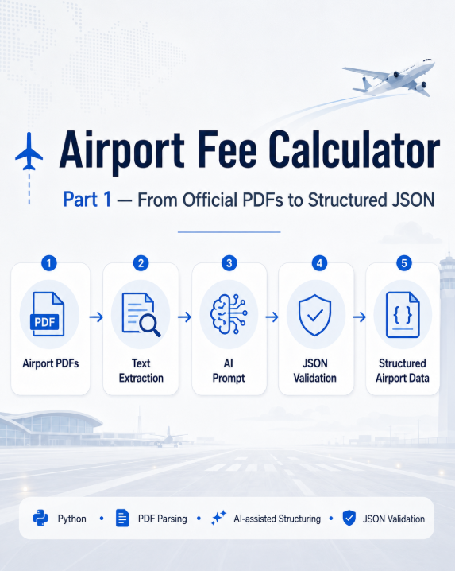
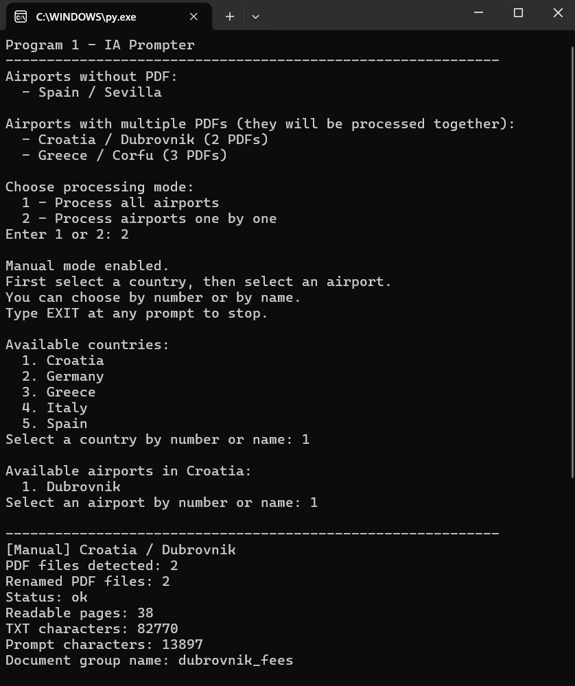
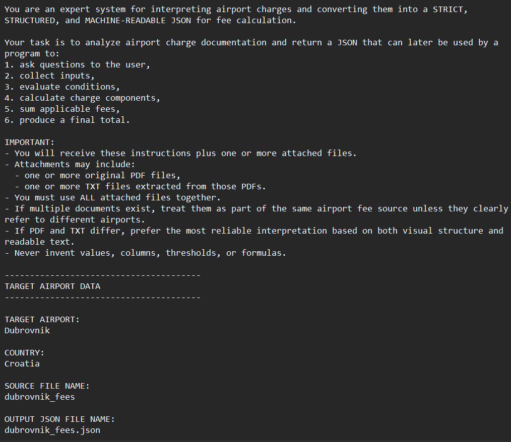
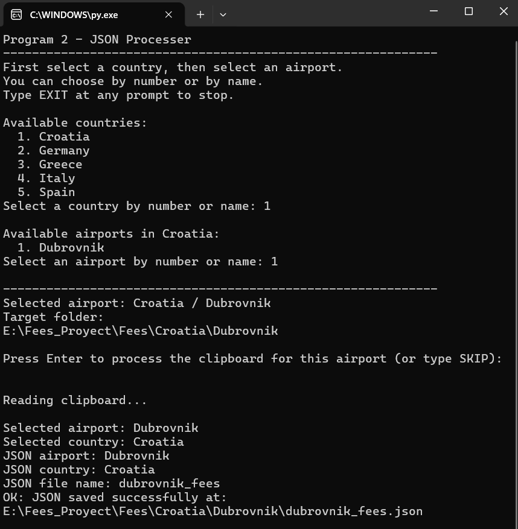
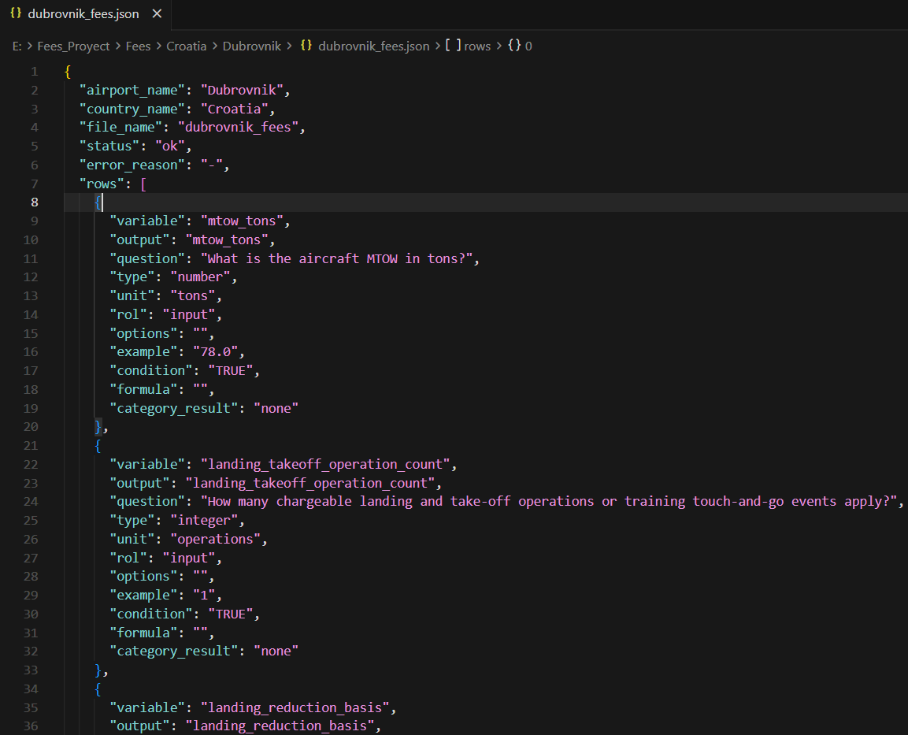
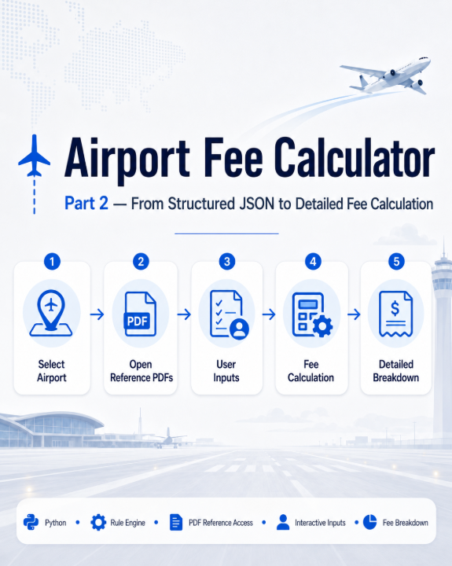
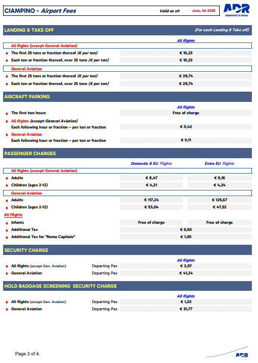
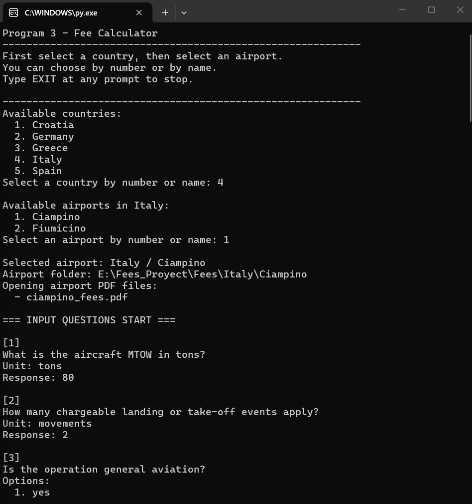
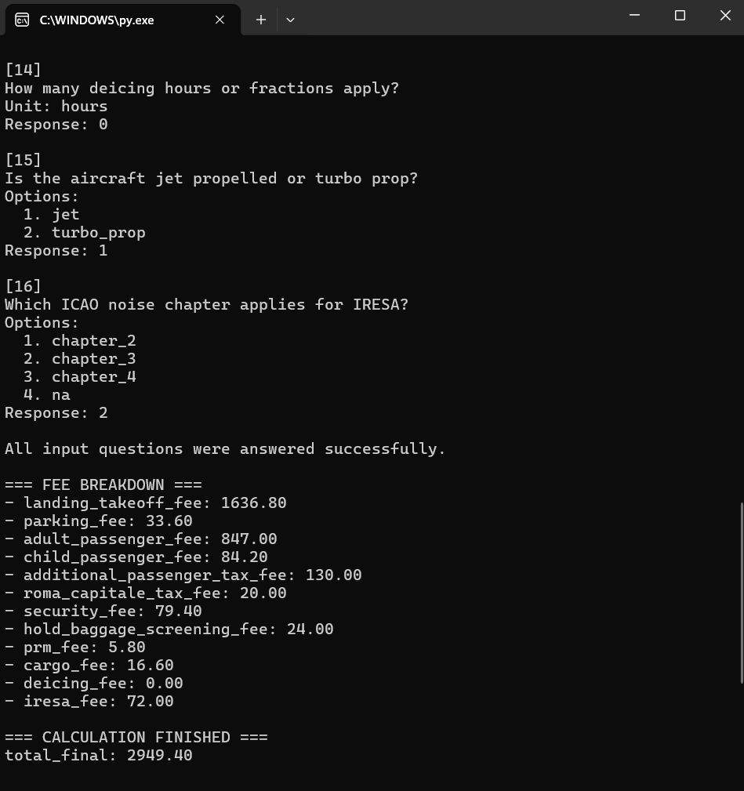

# Airport Fee Calculator

A prototype project that combines **Python automation** and **AI-assisted document structuring** to transform official airport fee documentation into a structured calculation workflow.

The project addresses a common problem in aviation: airport charges are often published in long PDF documents, using different formats, languages, structures and calculation criteria depending on the airport.

This makes it difficult to compare airports, estimate operating costs and support route planning decisions in a consistent way.

---

## Project Overview

The system is divided into three main stages:

### 1. PDF Processing and AI Prompt Generation

The first program scans a folder structure organized by country and airport, detects the available airport fee PDFs, normalizes file names, extracts the text and generates a customized AI prompt for each airport.

### 2. JSON Validation and Storage

The second program takes the JSON generated through the AI process, cleans it, validates it and checks that the airport and country names match the selected airport folder before saving it.

### 3. Interactive Fee Calculation

The third program reads the structured JSON, opens the official reference PDFs, asks the user only the operational questions required for that airport and calculates the applicable airport charges.

---

## Workflow

```text
Official Airport PDFs
        ↓
Text extraction
        ↓
AI prompt generation
        ↓
AI-assisted JSON structuring
        ↓
JSON validation
        ↓
Airport-specific data storage
        ↓
Interactive fee calculation
        ↓
Detailed fee breakdown
```

---

## Example Use Case

For a selected airport, the calculator can ask inputs such as aircraft MTOW, number of operations, passenger count, cargo volume, parking duration and other airport-specific operational variables.

It then evaluates the applicable conditions and formulas stored in the structured JSON and generates a transparent breakdown of the calculated charges.

---

## Why This Matters

Airport charges can vary significantly depending on airport, country, language, fee structure, aircraft type, passenger profile, operation type, local taxes and surcharges.

A standardized process like this could help reduce manual work, minimize calculation errors and improve the analysis, comparison and development of routes.

---

## Current Status

This is a working prototype.

At the current stage, the AI structuring step is semi-manual: the system generates the prompt and the AI response is later validated and stored by the JSON processor.

A future version could connect this pipeline directly to a local LLM or an AI API to automate the full process.

---

## Technologies Used

- Python
- PDF text extraction
- AI-assisted information structuring
- JSON validation
- Rule-based calculation engine
- Command-line interface

---

## Repository Scope

This repository is intended as a **technical project overview**.

It does not include the full private source code or the complete airport fee datasets. Instead, it contains documentation, screenshots and simplified examples showing the architecture and workflow of the project.

---

## Documentation

- [Architecture](docs/architecture.md)
- [Workflow](docs/workflow.md)
- [Future Improvements](docs/future-improvements.md)

## Screenshots

### Part 1 — From Official PDFs to Structured JSON

<p align="center">
  
</p>

<p align="center">
  
</p>

<p align="center">
  
</p>

<p align="center">
  
</p>

<p align="center">
  
</p>

---

### Part 2 — From Structured JSON to Detailed Fee Calculation

<p align="center">
  
</p>

<p align="center">
  
</p>

<p align="center">
  
</p>

<p align="center">
  
</p>
